# 谷粒商城gulimall

### 组织结构

```java
谷粒商城gulimall项目 （gulimall.com）
├── gulimall-common -- 工具类及通用代码
├── gulimall-admin – 后台管理服务  （admin.gulimall.com）
├── gulimall-generator –后台代码生成器
├── gulimall-auth-server -- 认证中心 （auth.gulimall.com）
├── gulimall-cart -- 购物车服务 （cart.gulimall.com）
├── gulimall-coupon -- 优惠卷服务
├── gulimall-gateway -- 统一配置网关
├── gulimall-order -- 订单服务（order.gulimall.com）
├── gulimall-product -- 商品服务 （item.gulimall.com）
├── gulimall-search -- 检索服务 （search.gulimall.com）
├── gulimall-seckill -- 秒杀服务 （seckill.gulimall.com）
├── gulimall-third-party -- 第三方服务 （OSS对象云存储、SMS云短信）
├── gulimall-ware -- 仓储服务
└── gulimall-member -- 会员服务 （member.gulimall.com）

```

### 搭建步骤

##### 所有资源都在resource目录下

##### 数据库在resource/db目录中

##### Nginx静态文件在resource/static目录中

##### 笔记、课件在 Guli Mall(包含代码、课件、sql)中

> Windows环境部署

- 修改本机的host文件，映射域名端口

```
192.168.120.20 gulimall.com
192.168.120.20	gulimall.com
192.168.120.20	search.gulimall.com
192.168.120.20  item.gulimall.com
192.168.120.20  auth.gulimall.com
192.168.120.20  cart.gulimall.com
192.168.120.20  order.gulimall.com
192.168.120.20  member.gulimall.com
192.168.120.20  seckill.gulimall.com
192.168.120.20  seckill.gulimall.com
127.0.0.1  admin.gulimall.com
127.0.0.1 sso.com
127.0.0.1 client1.com
127.0.0.1 client2.com
以上端口换成自己Linux的ip地址
```

- 修改Linux中Nginx的配置文件

```
1、在nginx.conf中添加负载均衡的配置    
upstream gulimall{
        server 192.168.120.1:88;
    }
2、在gulimall.conf中添加如下配置
server {
    listen       80;
    listen  [::]:80;
    server_name  gulimall.com  *.gulimall.com;

    #charset koi8-r;
    #access_log  /var/log/nginx/log/host.access.log  main;

    #access_log  /var/log/nginx/host.access.log  main;

    #配置静态资源的动态分离
    location /static/ {
        root   /usr/share/nginx/html;
    }

#支付异步回调的一个配置
    location /payed/ {
        proxy_set_header Host order.gulimall.com;        #不让请求头丢失
        proxy_pass http://gulimall;
    }

    location / {
        proxy_set_header Host $host;
        proxy_pass http://gulimall;
    }


    #error_page  404              /404.html;

    # redirect server error pages to the static page /50x.html
    #
    error_page   500 502 503 504  /50x.html;
    location = /50x.html {
        root   /usr/share/nginx/html;
    }

    # proxy the PHP scripts to Apache listening on 127.0.0.1:80
    #
    #location ~ \.php$ {
    #    proxy_pass   http://127.0.0.1;
    #}

    # pass the PHP scripts to FastCGI server listening on 127.0.0.1:9000
    #
    #location ~ \.php$ {
    #    root           html;
    #    fastcgi_pass   127.0.0.1:9000;
    #    fastcgi_index  index.php;
    #    fastcgi_param  SCRIPT_FILENAME  /scripts$fastcgi_script_name;
    #    include        fastcgi_params;
    #}

    # deny access to .htaccess files, if Apache's document root
    # concurs with nginx's one
    #
    #location ~ /\.ht {
    #    deny  all;
    #}
}


```

- 克隆前端项目 `gulimall-vue` 以 `npm run dev` 方式去运行
- 克隆整个后端项目 `gulimall` ，并导入 IDEA 中完成编译

### 技术选型

**后端技术**

|        技术        |           说明           |                      官网                       |
| :----------------: | :----------------------: | :---------------------------------------------: |
|     SpringBoot     |       容器+MVC框架       |     https://spring.io/projects/spring-boot      |
|    SpringCloud     |        微服务架构        |     https://spring.io/projects/spring-cloud     |
| SpringCloudAlibaba |        一系列组件        | https://spring.io/projects/spring-cloud-alibaba |
|    MyBatis-Plus    |         ORM框架          |             https://mp.baomidou.com             |
|  renren-generator  | 人人开源项目的代码生成器 |   https://gitee.com/renrenio/renren-generator   |
|   Elasticsearch    |         搜索引擎         |    https://github.com/elastic/elasticsearch     |
|      RabbitMQ      |         消息队列         |            https://www.rabbitmq.com             |
|   Springsession    |        分布式缓存        |    https://projects.spring.io/spring-session    |
|      Redisson      |         分布式锁         |      https://github.com/redisson/redisson       |
|       Docker       |       应用容器引擎       |             https://www.docker.com              |
|        OSS         |        对象云存储        |  https://github.com/aliyun/aliyun-oss-java-sdk  |

**前端技术**

|   技术    |    说明    |           官网            |
| :-------: | :--------: | :-----------------------: |
|    Vue    |  前端框架  |     https://vuejs.org     |
|  Element  | 前端UI框架 | https://element.eleme.io  |
| thymeleaf |  模板引擎  | https://www.thymeleaf.org |
|  node.js  | 服务端的js |   https://nodejs.org/en   |

### 架构图

**系统架构图**

[](https://imgchr.com/i/UUvRAS)

**业务架构图**


### 环境搭建

#### 开发工具

|     工具      |        说明         |                      官网                       |
| :-----------: | :-----------------: | :---------------------------------------------: |
|     IDEA      |    开发Java程序     |     https://www.jetbrains.com/idea/download     |
| RedisDesktop  | redis客户端连接工具 |        https://redisdesktop.com/download        |
|  SwitchHosts  |    本地host管理     |       https://oldj.github.io/SwitchHosts        |
|    X-shell    |  Linux远程连接工具  | http://www.netsarang.com/download/software.html |
|    Navicat    |   数据库连接工具    |       http://www.formysql.com/xiazai.html       |
| PowerDesigner |   数据库设计工具    |             http://powerdesigner.de             |
|    Postman    |   API接口调试工具   |             https://www.postman.com             |
|    Jmeter     |    性能压测工具     |            https://jmeter.apache.org            |
|    Typora     |   Markdown编辑器    |                https://typora.io                |

#### 开发环境

|     工具      | 版本号 |                             下载                             |
| :-----------: | :----: | :----------------------------------------------------------: |
|      JDK      |  1.8   | https://www.oracle.com/java/technologies/javase/javase-jdk8-downloads.html |
|     Mysql     |  5.7   |                    https://www.mysql.com                     |
|     Redis     | Redis  |                  https://redis.io/download                   |
| Elasticsearch | 7.6.2  |               https://www.elastic.co/downloads               |
|    Kibana     | 7.6.2  |               https://www.elastic.co/cn/kibana               |
|   RabbitMQ    | 3.8.5  |            http://www.rabbitmq.com/download.html             |
|     Nginx     | 1.1.6  |              http://nginx.org/en/download.html               |

注意：以上的除了jdk都是采用docker方式进行安装，详细安装步骤可参考百度!!!


**目** **录**

[第一章 作品概述... 1](#_Toc106120063)

[第二章 作品设计与实现... 2](#_Toc106120064)

[2.1系统需求分析... 2](#_Toc106120065)

[2.2系统功能模块设计... 2](#_Toc106120066)

[2.2.1 流程图... 2](#_Toc106120067)

[2.2.2 前台页面... 3](#_Toc106120068)

[2.2.3 后台管理模块... 8](#_Toc106120069)

[2.2.4认证中心模块gulimall-Auth（社交登录、OAuth2.0、单点登录）... 8](#_Toc106120070)

[2.2.5 本地事务和分布式事务（gulimall-Product）... 9](#_Toc106120071)

[2.2.6 缓存与分布式锁（gulimall-Seckill）... 9](#_Toc106120072)

[2.2.7 ElasticSearch-全文检索服务（gulimall-Search）... 10](#_Toc106120073)

[2.2.8 异步&线程池（gulimall-Order）... 10](#_Toc106120074)

[2.2.9 RabbitMQ（Message Queue消息队列）、秒杀下单（gulimall-Seckill）... 11](#_Toc106120075)

[2.2.10 支付（支付宝沙箱  gulimall-Order）... 11](#_Toc106120076)

[2.2.11 接口幂等性... 12](#_Toc106120077)

[2.2.12 定时任务与分布式调度（gulimall-Seckill）... 13](#_Toc106120078)

[2.2.13 商品上架... 13](#_Toc106120079)

[2.2.14 商品详情... 13](#_Toc106120080)

[2.2.16 购物车... 16](#_Toc106120081)

[2.2.17 订单... 17](#_Toc106120082)

[2.3数据库设计... 20](#_Toc106120083)

[2.4系统公用类与接口设计... 21](#_Toc106120084)

[2.4核心配置文件... 21](#_Toc106120085)


# 第一章 作品概述

本作品是一套分布式电商项目，包括前台商城系统以及后台管理系统，基于 Spring + SpringMVC + Mybatis + SpringCloud + SpringCloudAlibaba + MyBatis-Plus实现，采用 Docker 容器化部署。前台商城系统包括：用户登录、注册、商品搜索、商品详情、购物车、下订单流程、秒杀活动等模块。后台管理系统采用分布式架构包括：系统管理、商品系统、优惠营销、库存系统、订单系统、用户系统、内容管理等七大模块。

前端技术采用Vue（前端框架）、ElementUI（前端UI框架）、Thymeleaf（后端模板引擎）、Webpack（打包构建）、Node.js（服务端JS）

后端技术采用Spring（容器）、SpringBoot（MVC框架）、SpringCloud（微服务架构）、SpringCloudAlibaba（一系列中间件）、Mybatis（ORM框架）、MyBatis-Plus（简化Mybatis）、Renren-Generator（人人开源项目代码生成器）、MySQL（数据库）、Redis（缓存）、Nginx（负载均衡）、Elasticsearch（搜索引擎）、Kibana（数据可视化）、RabbitMQ（消息队列）、SpringSession（分布式缓存）、Redisson（Redis分布式锁）、Docker（应用容器引擎）、七牛云OSS（对象云存储）、容联云通讯SMS（云短信）、Nacos（服务注册中心、配置中心）、OpenFeign（远程RPC调用）、Gateway（API网关）、Ribbon（负载均衡）、Sleuth（调用链监控）、Zipkin（链路追踪）、Sentinel（服务限流、降级、熔断）、Seata（分布式事务）、PostMan（API接口调试）、Jmeter（性能压测）

后台项目采用前后端分离开发，Vue前台负责展示页面，Spring后台只提供API接口，方便前端进行调用。前台项目使用Thymeleaf作为模板引擎，采用动静分离的方式，静态资源部署在Linux的Nginx负载均衡服务器中，减小服务器压力。

本项目全方位涉及应用监控、限流、网关、熔断降级等分布式方案；大量使用线程池、异步编排，高并发场景的编码方式；使用分布式事务、分布式锁保证系统健壮；使用SpringCloud Alibaba 全新解决方案；完成压力测试与性能优化；使用Docker容器技术部署、上线服务，以及各种集群技术，CI / CD的使用。

 


# 第二章 作品设计与实现

## 2.1系统需求分析

随着现代人生活节奏的不断加快和计算机网络技术的飞速发展,电子商务已成为人们日常生活中不可或缺的一部分。电子商务中一种最普遍的形式就是网上商城,它已逐渐取代传统的线下实体店成为购物方式的首选。网上商城中最典型的一种模式就是B2C网上商城,它一方面提供网上购物平台给消费者,另一方面提供网上销售平台给商户。

## 2.2系统功能模块设计

### 2.2.1 流程图

​                                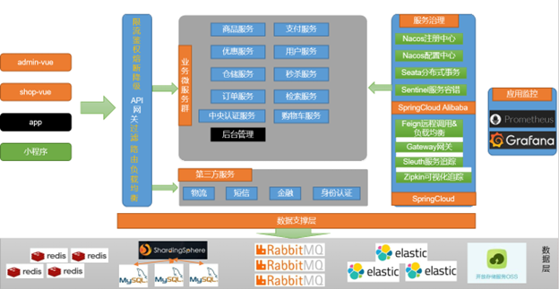

谷粒商城gulimall项目 （gulimall.com）

├── gulimall-common -- 工具类及通用代码

├── gulimall-admin – 后台管理服务  （admin.gulimall.com）

├── gulimall-generator –后台代码生成器

├── gulimall-auth-server -- 认证中心 （auth.gulimall.com）

├── gulimall-cart -- 购物车服务 （cart.gulimall.com）

├── gulimall-coupon -- 优惠卷服务

├── gulimall-gateway -- 统一配置网关

├── gulimall-order -- 订单服务（order.gulimall.com）

├── gulimall-product -- 商品服务 （item.gulimall.com）

├── gulimall-search -- 检索服务 （search.gulimall.com）

├── gulimall-seckill -- 秒杀服务 （seckill.gulimall.com）

├── gulimall-third-party -- 第三方服务 （OSS对象云存储、SMS云短信）

├── gulimall-ware -- 仓储服务

└── gulimall-member -- 会员服务 （member.gulimall.com）

### 2.2.2 前台页面

  


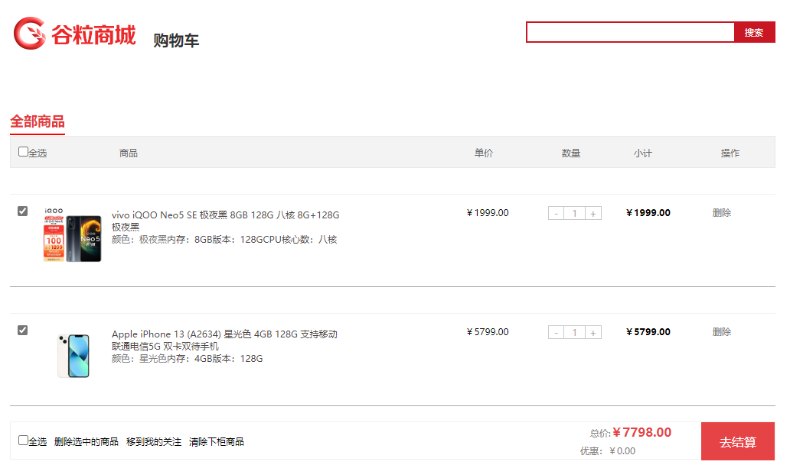

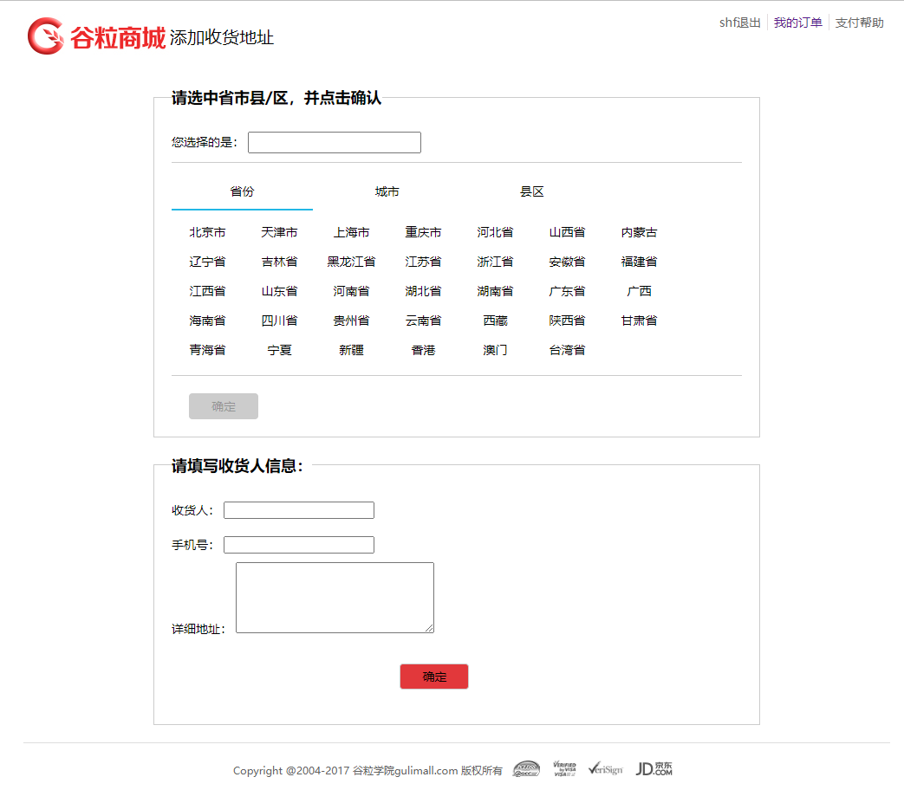

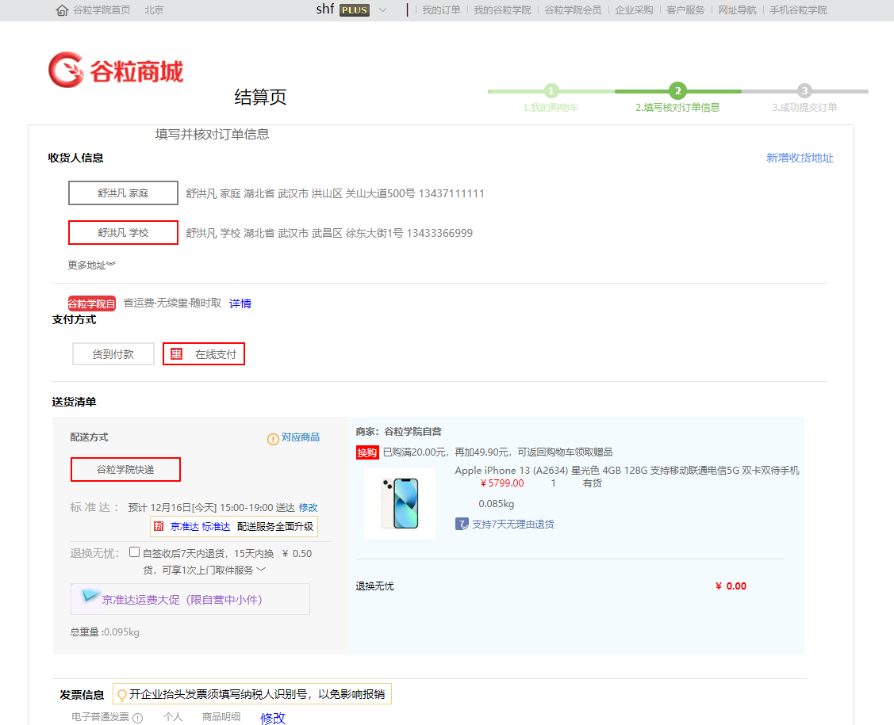


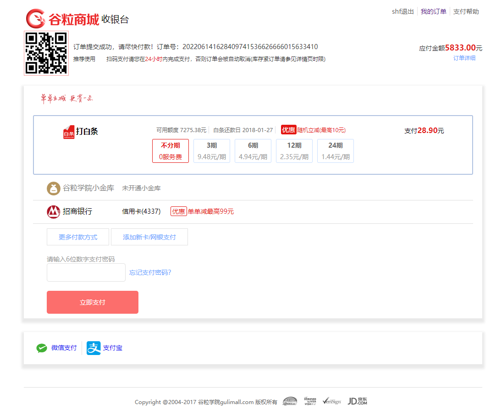


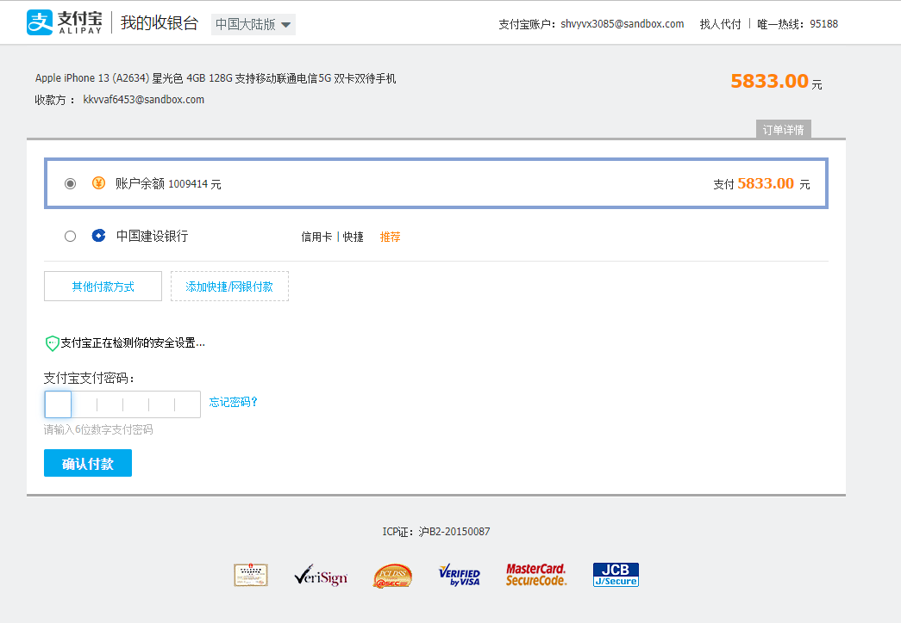

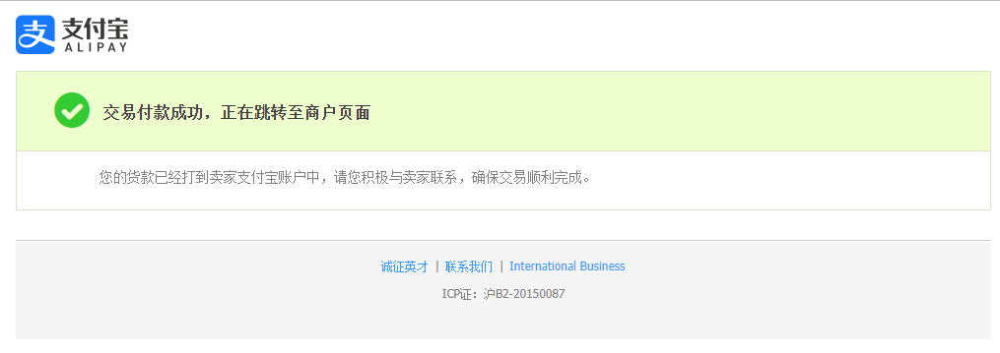

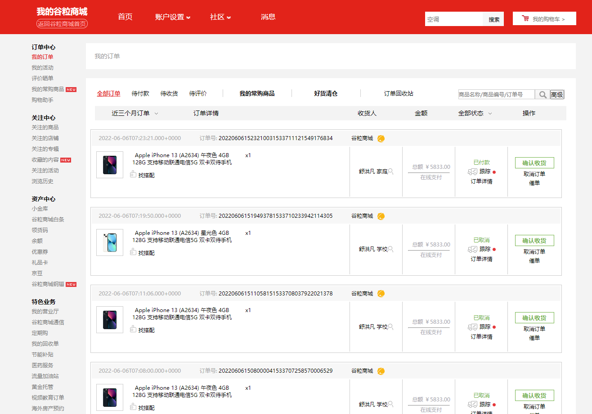

### 2.2.3 后台管理模块

后台管理系统是前后端分离模块，前端使用Vue、ElementUI构建页面，使用node.js和webpack进行项目模块化打包，后台管理系统通过Axios发送Ajax请求后台API网关，后台网关通过OpenFeign负载均衡请求后台gulimall-admin服务，完成数据的CURD。


  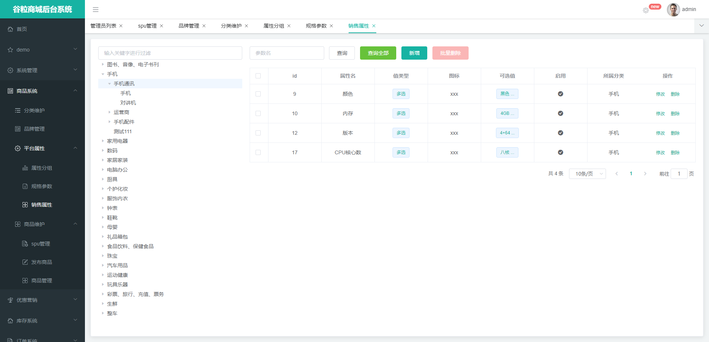

### 2.2.4认证中心模块gulimall-Auth（社交登录、OAuth2.0、单点登录）

认证中心模块主要负责用户登录注册，使用JSR-303实现表单参数校验，底层使用Hibernate Validator实现，如果参数不合法，抛出异常，使用@RestControllerAdvice注解开启全局异常处理，处理异常。用户注册时除了要输入用户名密码外，还需要输入SMS短信验证码，短信接口前台和后台都做了防刷处理，验证码发送成功后存入Redis，TTL设置10分钟有效，过期自动删除。用户登录成功后将用户信息存入Spring Session中，30分钟自动过期，Spring Session会同步各个微服务的session使其保持一致，以此来实现单点登录。需要登录的模块都有一个登录拦截器，如果未登录会跳转到Auth模块进行登录。由于网站有多个域名及子域名，需要使用cookieSerializer.setDomainName("gulimall.com")放大cookie作用域，不然多个微服务无法获取到用户设置的cookie。同时商城也能实现第三方社交登录，本商城使用的是微博社交登录。社交登录使用的OAuth2.0开放标准，允许用户让第三方应用访问该用户在某一网站上存储的私密的资源（如照片，视频，联系人列表），而无需将用户名和密码提供给第三方应用。OAuth 2.0的运行流程如下图，摘自RFC 6749。

  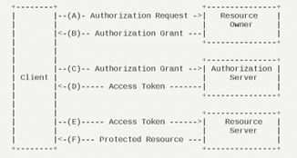

### 2.2.5 本地事务和分布式事务（gulimall-Product）

数据库事务的几个特性：原子性(Atomicity )、一致性( Consistency )、隔离性或独立性( Isolation)和持久性(Durabilily)，简称就是 ACID。在以往的单体应用中，我们多个业务操作使用同一条连接操作不同的数据表，一旦有异常，我们可以很容易的整体回滚，比如买东西业务，扣库存，下订单，账户扣款，是一个整体；必须同时成功或者失败。一个事务开始，代表以下的所有操作都在同一个连接里面。分布式系统经常出现的异常机器宕机、网络异常、消息丢失、消息乱序、数据错误、不可靠的 TCP、存储数据丢失...这个时候我们采用柔性事务（允许一定时间内，不同节点的数据不一致，但要求最终一致） + 可靠消息（使用RabbitMQ消息队列，做好消息确认机制，设定消费者必须手动ACK，每一个发送的消息都在数据库中做好记录，定期将失败的消息再次发送一次） + 最终一致性方案，即业务处理服务在业务事务提交之前，向实时消息服务请求发送消息，实时消息服务只记录消息数据，而不是真正的发送。业务处理服务在业务事务提交之后，向实时消息服务确认发送。只有在得到确认发送指令后，实时消息服务才会真正发送。

### 2.2.6 缓存与分布式锁（gulimall-Seckill）

为了系统性能的提升，我们一般都会将部分数据放入缓存中，加速访问。而数据库承担数据落盘工作。我们把即时性、数据一致性要求不高的，访问量大且更新频率不高的数据（读多，写少）的数据存储Redis缓存。缓存在大并发下又会存在缓存失效的问题。

缓存穿透是指查询一个不存在的数据，由于缓存是不命中，将去查询数据库，但是数据库也无此记录，我们没有将这次查询的 null 写入缓存，这将导致这个不存在的数据每次请求都要到存储层去查询，失去了缓存的意义。在流量大时，可能 DB 就挂掉了，要是有人利用不存在的 key 频繁攻击我们的应用，这就是漏洞，我们可以通过缓存空结果、并且设置短的过期时间来解决缓存穿透的问题。

缓存雪崩是指在我们设置缓存时采用了相同的过期时间，导致缓存在某一时刻同时失效，请求全部转发到 DB，DB 瞬时压力过重雪崩，我们可以通过将原有的失效时间基础上增加一个随机值，比如 1-5 分钟随机，这样每一个缓存的过期时间的重复率就会降低，就很难引发集体失效的事件。

缓存击穿是指对于一些设置了过期时间的 key，如果这些 key 可能会在某些时间点被超高并发地访问，是一种非常“热点”的数据。这个时候，需要考虑一个问题：如果这个 key 在大量请求同时进来前正好失效，那么所有对这个 key 的数据查询都落到 db。我们通过加分布式锁解决。

 Redis分布式锁通过setnxex获取锁，解锁为了保证解锁操作的原子性，我们用LUA脚本（ifredis.call('get',KEYS[1]) == ARGV[1] then returnredis.call('del',KEYS[1]) else return0 end）完成解锁操作，在本项目中我们使用Redission（架设在Redis基础上的一个JAVA驻内存数据网格）完成分布式锁，调用getLock方式获取锁，lock方法加锁，unlock方法解锁。

### 2.2.7 ElasticSearch-全文检索服务（gulimall-Search）

全文搜索属于最常见的需求，开源的 Elasticsearch 是目前全文搜索引擎的首选。它可以快速地储存、搜索和分析海量数据。维基百科、Stack Overflow、Github 都采用它。我们通过Query DSL（领域特定语言）操作ES中的数据，可以通过query查询，match匹配查询，match_phrase短语匹配，multi_match多字段匹配，bool符合查询，filter结果过滤，aggregations执行聚合，使用Mapping进行映射（用来定义一个文档（document），以及它所包含的属性（field）是如何存储和索引的）。然后我们安装了IK分词器，并且自定义词库，让ES支持中文分词。

本项目中的商品搜索功能将不查询数据库，商品上架后时，将商品数据存入ES，每次检索都从ES中获取数据，减轻数据库压力，每次拼接条件我们都使用Elasticsearch-Rest-Client中的boolQueryBuilder进行条件的拼接（模糊匹配，过滤（按照属性，分类，品牌，价格区间，库存），排序，分页，高亮，聚合分析），条件拼接好后，之前返回给前端页面通过模板引擎渲染。

Ø 检索条件&排序条件

l 全文检索：skuTitle

l 排序：saleCount、hotScore、skuPrice

l 过滤：hasStock、skuPrice 区间、brandId、catalogId、attrs

l 聚合：attrs

Ø 完整的 url 参数

**keyword**=小米&**sort**=saleCount_desc/asc&**hasStock**=0/1&**skuPrice**=400_1900&**brandId**=1

&**catalogId**=1&**attrs**=1_3G:4G:5G&**attrs**=2_骁龙 845&**attrs**=4_高清屏

Ø 构建构建结果数据

### 2.2.8 异步&线程池（gulimall-Order）

初始化线程的4种方式，继承 Thread、实现 Runnable 接口、实现 Callable 接口 + FutureTask （可以拿到返回结果，可以处理异常）、线程池。通过线程池性能稳定，也可以获取执行结果，并捕获异常。但是，在业务复杂情况下，一个异步调用可能会依赖于另一个异步调用的执行结果，这个时候就需要使用CompletableFuture 进行异步编排。本项目中查询商品详情页的逻辑比较复杂（获取sku的基本信息0.5秒、获取sku的图片信息0.5秒、获取sku的促销信息1秒、获取spu的所有销售属性1秒、获取规格参数数组下的规格参数1.5秒、spu详情1秒），有些数据还需要远程调用，必然需要花费更多的时间。假如商品详情页的每个查询，需要如上标注的时间才能完成,那么，用户需要 5.5s 后才能看到商品详情页的内容。很显然是不能接受的。如果有多个线程同时完成这 6 步操作，也许只需要 1.5s 即可完成响应。在 Java 8 中, 新增加了一个包含 50 个方法左右的类: CompletableFuture，提供了非常强大的Future 的扩展功能，可以帮助我们简化异步编程的复杂性，提供了函数式编程的能力，可以通过回调的方式处理计算结果，并且提供了转换和组合 CompletableFuture 的方法。CompletableFuture 类实现了 Future 接口，所以你还是可以像以前一样通过`get`方法阻塞或者轮询的方式获得结果，但是这种方式不推荐使用。CompletableFuture 和 FutureTask 同属于 Future 接口的实现类，都可以获取线程的执行结果。CompletableFuture 提供了四个静态方法来创建一个异步操作。runXxxx 都是没有返回结果，supplyXxx 都是可以获取返回结果；可以传入自定义的线程池，否则就用默认的线程池；whenComplete 可以处理正常和异常的计算结果，exceptionally 处理异常情况；方法不以 Async 结尾，意味着 Action 使用相同的线程执行，而 Async 可能会使用其他线程执行（如果是使用相同的线程池，也可能会被同一个线程选中执行）。多个任务组合使用allOf（等待所有任务完成）；anyOf（只要有一个任务完成）。

### 2.2.9 RabbitMQ（Message Queue消息队列）、秒杀下单（gulimall-Seckill）

消息中间件可以通过消息队列发送异步消息实现异步处理，在用户注册时将注册信息写入数据库，给消息队列中发送一个用户注册成功的消息，消息队列会订阅并异步读取注册成功数据，并异步完成发送注册邮件和发送注册短信方法。消息队列也可以实现应用解耦，在商城中Product商品系统调用Ware库存系统时，商品系统向消息队列写入下单成功消息，库存系统订阅下单成功消息，实时去DB或Redis中锁定库存，如果用户30分钟之内用户没有付款，订单自动取消，再次发送消息，MQ订阅取消订单消息，解锁库存，自动完成收单操作。同时消息队列也能完成流量控制（流量削锋），在商城的秒杀业务中，将用户百万并发请求写入消息队列，秒杀服务Seckill订阅用户秒杀消息，首先确定当前属于哪个秒杀场次，再从Redis中查询出所有key是’seckill’的数据，遍历循环出当前秒杀的商品信息，如果在秒杀时间之内给商品设置请求随机码UUID，秒杀下单时需要携带用户登录cookie、请求随机码UUID、商品Id才能下单成功，错误的请求随机码无法完成下单，以此来防止恶意攻击；如果不是秒杀时间，不设置请求随机码，用户无法提前获得秒杀下单参数信息，保证秒杀业务的健壮性。再从Redis中查询到所有根据缓存在Redis中的信号量（库存数量）判断是否有货，如果有货，判断这个人是否已经买过了（商品幂等性处理），如果秒杀成功就去Redis中占位，格式如下：userId-sessionId-skuId。数据验证成功后执行快速下单逻辑，通过分布式锁信号量减1（原子性操作），将创建的订单号和订单信息发送给MQ消息队列，由订单服务Order、商品服务Product、库存服务Ware完成消息订阅，并且对消息进行可靠ACK消费。

### 2.2.10 支付（支付宝沙箱 gulimall-Order）

本商城支付功能使用的是支付宝沙箱。支付宝沙箱账号和买家账号可以任意充值。支付会为我们生成应用公钥、应用私钥以及支付宝公钥。我们在maven项目中导入支付宝SDK，通过应用公钥、应用私钥、支付宝公钥、支付成功后支付宝告诉我们支付成功的回调地址（需要公网IP地址，支付宝才能回调，本商城使用的是花生壳内网穿透，允许我们使用外网的网址来访问主机）、支付成功后的回调地址来实例化AlipayClient对象，并且通过setBizContent给支付传递订单信息，包括商户订单号、付款金额、订单名称以及商品描述，通过alipayClient.pageExecute(alipayRequest).getBody()获得支付宝返回的收银台页面，直接响应到前台。用户使用支付宝沙箱版扫码付款或者输入支付宝沙箱的账号密码进行支付。买家支付成功后支付宝会给我们的notify_url发送订单支付成功的消息，我们需要对确认支付业务进行验签（支付宝为了验证请求的数据是否商户本人发的，商户为了验证响应的数据是否支付宝发的）AlipaySignature.rsaCheckV1验签成功后，修改订单状态。如果用户想要退款调用alipay.trade.refund发起退款请求，调用alipay.trade.fastpay.refund.query对退款进度进行查询。

### 2.2.11 接口幂等性

接口幂等性就是用户对于同一操作发起的一次请求或者多次请求的结果是一致的，不会因为多次点击而产生了副作用；比如说支付场景，用户购买了商品支付扣款成功，但是返回结果的时候网络异常，此时钱已经扣了，用户再次点击按钮，此时会进行第二次扣款，返回结果成功，用户查询余额返发现多扣钱了，流水记录也变成了两条．．．,这就没有保证接口的幂等性。在用户多次点击按钮、用户页面回退再提交，微服务互相调用，由于网络问题，导致请求失败，Feign触发重试机制等业务中都需要防止接口幂等。幂等解决方案主要有有以下三个方面。

第一使用token机制。服务端提供了发送 token 的接口。我们在分析业务的时候，哪些业务是存在幂等问题的，就必须在执行业务前，先去获取 token，服务器会把 token 保存到 redis 中。然后调用业务接口请求时，把 token 携带过去，一般放在请求头部。服务器判断 token 是否存在 redis 中，存在表示第一次请求，然后删除 token,继续执行业务。如果判断 token 不存在 redis 中，就表示是重复操作，直接返回重复标记给 client，这样就保证了业务代码，不被重复执行。这种方案存在两个危险性首先是先删除 token 还是后删除 token；先删除可能导致，业务确实没有执行，重试还带上之前 token，由于防重设计导致，请求还是不能执行。后删除可能导致，业务处理成功，但是服务闪断，出现超时，没有删除 token，别人继续重试，导致业务被执行两遍。我们最好设计为先删除 token，如果业务调用失败，就重新获取 token 再次请求。其次要求Token 获取、比较和删除必须是原子性的。redis.get(token) 、token.equals、redis.del(token)如果这两个操作不是原子，可能导致，高并发下，都 get 到同样的数据，判断都成功，继续业务并发执行可以在 redis 使用 lua 脚本完成这个操作：if redis.call('get', KEYS[1]) == ARGV[1] then return redis.call('del', KEYS[1]) else return 0；

第二是使用各种锁机制。数据库悲观锁，悲观锁使用时一般伴随事务一起使用，数据锁定时间可能会很长，需要根据实际情况选用。另外要注意的是，id 字段一定是主键或者唯一索引，不然可能造成锁表的结果，处理起来会非常麻烦；数据库乐观锁，这种方法适合在更新的场景中，根据 version 版本，也就是在操作库存前先获取当前商品的 version 版本号，然后操作的时候带上此 version 号。我们梳理下，我们第一次操作库存时，得到 version 为 1，调用库存服务 version 变成了 2；但返回给订单服务出现了问题，订单服务又一次发起调用库存服务，当订单服务传如的 version 还是 1，再执行上面的 sql 语句时，就不会执行；因为 version 已经变 为 2 了，where 条件就不成立。这样就保证了不管调用几次，只会真正的处理一次。 乐观锁主要使用于处理读多写少的问题；业务层分布式锁，如果多个机器可能在同一时间同时处理相同的数据，比如多台机器定时任务都拿到了相同数据处理，我们就可以加分布式锁，锁定此数据，处理完成后释放锁。获取到锁的必须先判断这个数据是否被处理过。

第三是各种唯一约束。数据库唯一约束，插入数据，应该按照唯一索引进行插入，比如订单号，相同的订单就不可能有两条记录插入。我们在数据库层面防止重复。这个机制是利用了数据库的主键唯一约束的特性，解决了在 insert 场景时幂等问题。但主键的要求不是自增的主键，这样就需要业务生成全局唯一的主键。如果是分库分表场景下，路由规则要保证相同请求下，落地在同一个数据库和同一表中，要不然数据库主键约束就不起效果了，因为是不同的数据库和表主键不相关；redis set 防重，很多数据需要处理，只能被处理一次，比如我们可以计算数据的 MD5 将其放入 redis 的 set， 每次处理数据，先看这个 MD5 是否已经存在，存在就不处理；防重表，使用订单号 orderNo 做为去重表的唯一索引，把唯一索引插入去重表，再进行业务操作，且他们在同一个事务中。这个保证了重复请求时，因为去重表有唯一约束，导致请求失败，避免了幂等问题。这里要注意的是，去重表和业务表应该在同一库中，这样就保证了在同一个事务，即使业务操作失败了，也会把去重表的数据回滚。这个很好的保证了数据一致性；全局请求唯一，调用接口时，生成一个唯一 id，redis 将数据保存到集合中（去重），存在即处理过。可以使用 nginx 设置每一个请求的唯一 id； proxy_set_header X-Request-Id $request_id。

### 2.2.12 定时任务与分布式调度（gulimall-Seckill）

本商城中定时任务都使用cron表达式来表示。在SpringBoot中使用@EnableScheduling、@Scheduled开启定时任务。商城中使用定时任务@Scheduled(cron = "0 0 3 * * ? ") 每天凌晨3点上架最近3天的秒杀商品，并将商品存入Redis数据库，缓存活动信息和缓存活动关联的商品详细信息。在调用上架远程接口之前需要获取分布式锁，锁的业务执行完成,状态已经完成更新；释放锁以后,其他人获取到就会拿到最新的状态。

### 2.2.13 商品上架

上架的商品才可以在网站展示。上架的商品需要可以被检索。

商品上架在 es 中是存 sku 还是 spu，检索的时候输入名字，是需要按照 sku 的 title 进行全文检索的，检索使用商品规格，规格是 spu 的公共属性，每个 spu 是一样，按照分类 id 进去的都是直接列出 spu 的，还可以切换；我们如果将 sku 的全量信息保存到 es 中（包括 spu 属性）就太多量字段了；我们如果将 spu 以及他包含的 sku 信息保存到 es 中，也可以方便检索。但是 sku 属于spu 的级联对象，在 es 中需要 nested 模型，这种性能差点，但是存储与检索我们必须性能折中。如果我们分拆存储，spu 和 attr 一个索引，sku 单独一个索引可能涉及的问题。检索商品的名字，如“手机”，对应的 spu 有很多，我们要分析出这些 spu 的所有关联属性，再做一次查询，就必须将所有 spu_id 都发出去。假设有 1 万个数据，数据传输一次就10000*4=4MB；并发情况下假设 1000 检索请求，那就是 4GB 的数据，传输阻塞时间会很长，业务更加无法继续。所以，我们使用宽表设计，这样才是文档区别于关系型数据库的地方，不能去考虑数据库范式。

上架是将后台的商品放在 es 中可以提供检索和查询。hasStock：代表是否有库存。默认上架的商品都有库存。如果库存无货的时候才需要更新一下，库存补上以后，也需要重新更新一下 es，hotScore 是热度值，我们只模拟使用点击率更新热度。点击率增加到一定程度才更新热度值，下架就是从 es 中移除检索项，以及修改 DB状态。

### 2.2.14 商品详情

```
    @Override
    public SkuItemVo item(Long skuId) throws ExecutionException, InterruptedException {
        SkuItemVo skuItemVo = new SkuItemVo();
        CompletableFuture<SkuInfoEntity> infoFuture = CompletableFuture.supplyAsync(() -> {
            //1、sku基本信息的获取  pms_sku_info
            SkuInfoEntity info = this.getById(skuId);
            skuItemVo.setInfo(info);
            return info;
        }, executor);
        CompletableFuture<Void> saleAttrFuture = infoFuture.thenAcceptAsync((res) -> {
            //3、获取spu的销售属性组合
            List<SkuItemSaleAttrVo> saleAttrVos = skuSaleAttrValueService.getSaleAttrBySpuId(res.getSpuId());
            skuItemVo.setSaleAttr(saleAttrVos);
        }, executor);
        CompletableFuture<Void> descFuture = infoFuture.thenAcceptAsync((res) -> {
            //4、获取spu的介绍    pms_spu_info_desc
            SpuInfoDescEntity spuInfoDescEntity = spuInfoDescService.getById(res.getSpuId());
            skuItemVo.setDesc(spuInfoDescEntity);
        }, executor);
        CompletableFuture<Void> baseAttrFuture = infoFuture.thenAcceptAsync((res) -> {
            //5、获取spu的规格参数信息
            List<SpuItemAttrGroupVo> attrGroupVos = attrGroupService.getAttrGroupWithAttrsBySpuId(res.getSpuId(), res.getCatalogId());
            skuItemVo.setGroupAttrs(attrGroupVos);
        }, executor);
        //2、sku的图片信息    pms_sku_images
        CompletableFuture<Void> imageFuture = CompletableFuture.runAsync(() -> {
            List<SkuImagesEntity> imagesEntities = skuImagesService.getImagesBySkuId(skuId);
            skuItemVo.setImages(imagesEntities);
        }, executor);
        //3、远程调用查询当前sku是否参与秒杀优惠活动
        CompletableFuture<Void> seckillFuture = CompletableFuture.runAsync(() -> {
            R skuSeckilInfo = seckillFeignService.getSkuSeckilInfo(skuId);
            if (skuSeckilInfo.getCode() == 0) {//查询成功
                                SeckillSkuVo seckilInfoData = skuSeckilInfo.getData("data", new TypeReference<SeckillSkuVo>() {});
                skuItemVo.setSeckillSkuVo(seckilInfoData);
                if (seckilInfoData != null) {
                    long currentTime = System.currentTimeMillis();
                    if (currentTime > seckilInfoData.getEndTime()) {
                        skuItemVo.setSeckillSkuVo(null);
                    }
                }
            }
        }, executor);
        //等到所有任务都完成
        CompletableFuture
                .allOf(saleAttrFuture,descFuture,baseAttrFuture,imageFuture,seckillFuture)
                .get();
        return skuItemVo;
    }
```

Ø 前台sku组合切换核心代码（页面遍历）

<div class="box-attr clear" th:each="attr : ${item.saleAttr}">     <dl>         <dt>选择[[${attr.attrName}]]</dt>         <dd th:each="val : ${attr.attrValues}">             <a th:attr=" class=${#lists.contains(#strings.listSplit(val.skuIds,','),item.info.skuId.toString())                ? 'sku_attr_value checked': 'sku_attr_value'}, skus=${val.skuIds} ">                 [[${val.attrValue}]]             </a>         </dd>     </dl> </div>
Ø 前台sku组合切换核心代码（动态切换js）

```
$(".sku_attr_value").click(function () {
   *// 1**、点击的元素添加上自定义的属性**
\*   let skus = new Array();
   let curr = $(this).attr("skus").split(",");
   *//* *当前被点击的所有**sku**组合数组放进去**
\*   skus.push(curr)
   *//* *去掉同行的所有**checked
\* $(this).parent().parent().find(".sku_attr_value").removeClass("checked");
   $(this).addClass("checked");
   *changeCheckedStyle*();
   $("a[class='sku_attr_value checked']").each(function () {
     skus.push($(this).attr("skus").split(","));
   });
   console.log(skus)
   console.log($(skus[0]).filter(skus[1])[0])
   let filterEle = skus[0];
   for (let i = 1; i < skus.length; i++) {
     filterEle = $(filterEle).filter(skus[i]);
   }
   console.log(filterEle[0])
   location.href = "http://item.gulimall.com/" + filterEle[0] + ".html";
   return false;
 });
```

Ø 关键sql

```
SELECT
    ssav.`attr_id` attr_id,
    ssav.`attr_name` attr_name,
    ssav.`attr_value`,
    GROUP_CONCAT(DISTINCT info.`sku_id`) sku_ids
FROM `pms_sku_info` info
         LEFT JOIN `pms_sku_sale_attr_value` ssav ON
        ssav.`sku_id`=info.`sku_id`
WHERE info.`spu_id`= #{spuId}
GROUP BY ssav.`attr_id`,ssav.`attr_name`,ssav.`attr_value`
```

  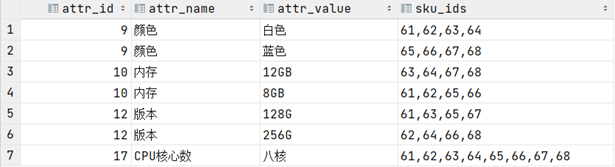

### 2.2.16 购物车

用户可以在登录状态下和非登录状态下将商品添加到购物车，登录以后，会将临时购物车的数据全部合并过来，并清空临时购物车；所有购物车的数据都存放在Redis中，即使浏览器关闭，下次进入，临时购物车的数据都在。

Redis 有 5 种不同数据结构，这里选择哪一种比较合适。首先不同用户应该有独立的购物车，因此购物车应该以用户的作为 key 来存储，Value 是用户的所有购物车信息。这样看来基本的`k-v`结构就可以了。但是，我们对购物车中的商品进行增、删、改操作，基本都需要根据商品 id 进行判断，为了方便后期处理，我们的购物车也应该是`k-v`结构，key 是商品 id，value 才是这个商品的购物车信息，综上所述，我们的购物车结构是一个双层 Map：Map<String,Map<String,String>>，第一层 Map，Key 是用户 id，第二层 Map，Key 是购物车中商品 id，值是购物项数据。

Ø 临时购物车

```
private BoundHashOperations<String, Object, Object> getCartOps() {
   *//**先得到当前用户信息**
\*   UserInfoTo userInfoTo = CartInterceptor.*toThreadLocal*.get();
   String cartKey = "";
   if (userInfoTo.getUserId() != null) {
     *//gulimall:cart:1
\*     cartKey = *CART_PREFIX* + userInfoTo.getUserId();
   } else {
     cartKey = *CART_PREFIX* + userInfoTo.getUserKey();
   }
   *//**绑定指定的**key**操作**Redis
\*   BoundHashOperations<String, Object, Object> operations = redisTemplate.boundHashOps(cartKey);
   return operations;
 }

Ø 登录购物车

@Override
   public CartVo getCart() throws ExecutionException, InterruptedException {
     CartVo cartVo = new CartVo();
 *//*    *通过线程获取用户信息**
\*     UserInfoTo userInfoTo = CartInterceptor.*toThreadLocal*.get();
     if (userInfoTo.getUserId() != null) {
       *//1**、登录**
\*       String cartKey = *CART_PREFIX* + userInfoTo.getUserId();
       *//**临时购物车的键**
\*       String temptCartKey = *CART_PREFIX* + userInfoTo.getUserKey();
       *//2**、如果临时购物车的数据还未进行合并**
\*       List<CartItemVo> tempCartItems = getCartItems(temptCartKey);
       if (tempCartItems != null) {
         *//**临时购物车有数据需要进行合并操作**
\*         for (CartItemVo item : tempCartItems) {
           addToCart(item.getSkuId(),item.getCount());
         }
         *//**清除临时购物车的数据**
\*         clearCartInfo(temptCartKey);
       }
       *//3**、获取登录后的购物车数据【包含合并过来的临时购物车的数据和登录后购物车的**
\*       List<CartItemVo> cartItems = getCartItems(cartKey);
       cartVo.setItems(cartItems);
     } else {*//**没登录*
       String cartKey = *CART_PREFIX* + userInfoTo.getUserKey();
       *//**获取临时购物车里面的所有购物项**
\*       List<CartItemVo> cartItems = getCartItems(cartKey);
       cartVo.setItems(cartItems);
     }
     return cartVo;
   }
```


### 2.2.17 订单

电商系统涉及到 3 流，分别时信息流，资金流，物流，而订单系统作为中枢将三者有机的集合起来。订单模块是电商系统的枢纽，在订单这个环节上需求获取多个模块的数据和信息，同时对这些信息进行加工处理后流向下个环节，这一系列就构成了订单的信息流通。

订单流程是指从订单产生到完成整个流转的过程，从而行程了一套标准流程规则。而不同的产品类型或业务类型在系统中的流程会千差万别，比如上面提到的线上实物订单和虚拟订单的流程，线上实物订单与 O2O 订单等，所以需要根据不同的类型进行构建订单流程。不管类型如何订单都包括正向流程和逆向流程，对应的场景就是购买商品和退换货流程，正向流程就是一个正常的网购步骤：订单生成–>支付订单–>卖家发货–>确认收货–>交易成功。而每个步骤的背后，订单是如何在多系统之间交互流转的，可概括如下图

  

Ø 下单业务核心代码

```
@Transactional(rollbackFor = Exception.class)*
\*   @Override
   public SubmitOrderResponseVo submitOrder(OrderSubmitVo vo) 
     confirmVoThreadLocal.set(vo);
     SubmitOrderResponseVo responseVo = new SubmitOrderResponseVo()*
     //**获取当前用户登录的信息**
\*     MemberResponseVo memberResponseVo = LoginUserInterceptor.*loginUser*.get();
     responseVo.setCode(0);
     *//1**、验证令牌是否合法【令牌的对比和删除必须保证原子性】**
\*     String script = "if redis.call('get', KEYS[1]) == ARGV[1] then return redis.call('del', KEYS[1]) else return 0 end";
     String orderToken = vo.getOrderToken();*
\*     Long result = redisTemplate.execute(
         new DefaultRedisScript<Long>(script, Long.class),
        Arrays.*asList*(OrderConstant.*USER_ORDER_TOKEN_PREFIX* + memberResponseVo.getId()),
         orderToken
     );
     if (result == 0L) { *//**令牌验证失败**
\*       responseVo.setCode(1);
       return responseVo;
     } else {*//**令牌验证成功**
\*     OrderCreateTo order = createOrder();*//1**、创建订单订单项等信息*
       *//2**、验证价格**
\*       BigDecimal payAmount = order.getOrder().getPayAmount();
       BigDecimal payPrice = vo.getPayPrice();
       if (Math.*abs*(payAmount.subtract(payPrice).doubleValue()) < 0.01) {*
\*         saveOrder(order);
         *//4**、库存锁定**,**只要有异常，回滚订单数据**
\*         WareSkuLockVo lockVo = new WareSkuLockVo();
         lockVo.setOrderSn(order.getOrder().getOrderSn());
         *//**获取出要锁定的商品数据信息**
\*         List<OrderItemVo> orderItemVos = order.getOrderItems().stream().map((item) -> {
           OrderItemVo orderItemVo = new OrderItemVo();
           orderItemVo.setSkuId(item.getSkuId());
           orderItemVo.setCount(item.getSkuQuantity());
           orderItemVo.setTitle(item.getSkuName());
           return orderItemVo;
         }).collect(Collectors.*toList*());
         lockVo.setLocks(orderItemVos);
         R r = wmsFeignService.orderLockStock(lockVo);
         if (r.getCode() == 0) {
           *//**锁定成功**
\*           responseVo.setOrder(order.getOrder());*
           //TODO* *订单创建成功，发送消息给**MQ
\* rabbitTemplate.convertAndSend("order-event-exchange","order.create.order",order.getOrder());
           *//**删除购物车里的数据*redisTemplate.delete(*CART_PREFIX*+memberResponseVo.getId());
           return responseVo;
         } else {
           *//**锁定失败**
\*           String msg = (String) r.get("msg");
           throw new NoStockException(msg);
         }
       } else {
         responseVo.setCode(2);
         return responseVo;
       }
     }
   }
```


## 2.3数据库设计

  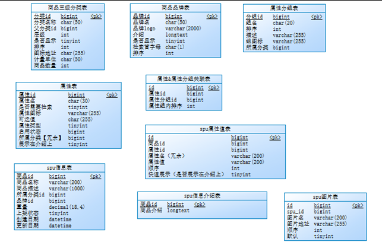

  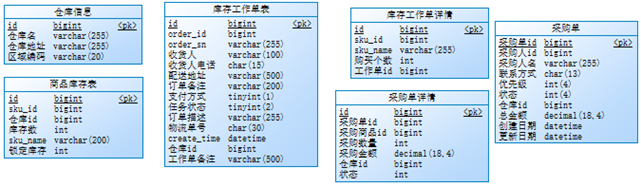

  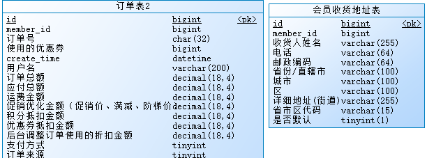

## 2.4系统公用类与接口设计

Ø 公用返回数据类

```
public class R extends HashMap<String, Object> {
  private static final long *serialVersionUID* = 1L;
  public R setData(Object data) {
    put("data",data);
    return this;
  }
   public static R error(int code, String msg) {
    R r = new R();
    r.put("code", code);
    r.put("msg", msg);
    return r;
  }
  public static R ok(String msg) {
    R r = new R();
    r.put("msg", msg);
    return r;
  }
  public static R ok(Map<String, Object> map) {
    R r = new R();
    r.putAll(map);
    return r;
  }
  public static R ok() {
    return new R();
  }
  public R put(String key, Object value) {
    super.put(key, value);
    return this;
  }
 }
```


## 2.4核心配置文件

Ø application.properties

```
spring.cache.type=*redis**
\* spring.cache.redis.time-to-live=3600000*
\* spring.cache.redis.cache-null-values=true*
\* spring.zipkin.base-url=http://192.168.120.20:9411/*
\* spring.zipkin.discovery-client-enabled=false
 spring.zipkin.sender.type=*web**
\* spring.sleuth.sampler.probability=1
 spring.cloud.sentinel.transport.dashboard=192.168.120.20:8858
 spring.cloud.sentinel.transport.port=8719
 management.endpoints.web.exposure.include=*
```

Ø application.yml

```
server:
  port: 10000
  servlet:
   session:
    timeout: 30m
 spring:
  application:
   name: gulimall-product
  datasource:
   username: root
   password: root
   url: jdbc:mysql://192.168.120.20:3306/gulimall_pms?useUnicode=true&characterEncoding=UTF-8&serverTimezone=Asia/Shanghai
   driver-class-name: com.mysql.cj.jdbc.Driver
  cloud:
   nacos:
    discovery:
     server-addr: 192.168.120.20:8848
   sentinel:
    transport:*
\*     dashboard: 192.168.120.20:8858
  redis:
   host: 192.168.120.20
   port: 6379*
\* feign:
  sentinel:
   enabled: true
  jackson:
   date-format: yyyy-MM-dd HH:mm:ss
  session:
   store-type: redis
 mybatis-plus:
  mapper-locations: classpath:/mapper/**/*.xml*
\*  global-config:
   db-config:
    id-type: *auto**
\*    logic-delete-value: 1
    logic-not-delete-value: 0
```
